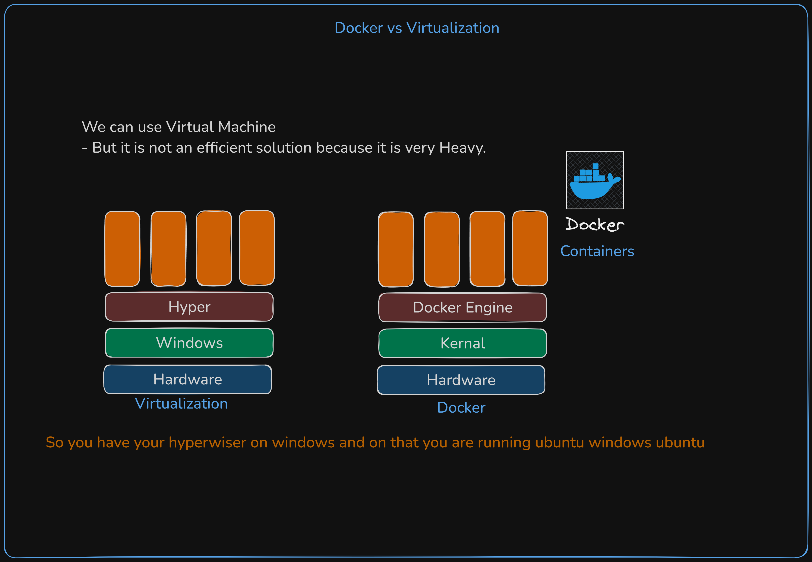

# Docker vs Virtual Machines: Understanding the Difference 🔄

## Traditional Virtualization vs Containerization 🤔

<div align="center">

</div>

### Virtual Machines Architecture 💻
```ascii
+--------------------------------------------------+
|     App 1     |     App 2     |     App 3                                               |
+--------------------------------------------------+
|   Guest OS 1  |   Guest OS 2  |   Guest OS 3                              |
+--------------------------------------------------+
|           Hypervisor (VMware, VirtualBox)                                   |
+--------------------------------------------------+
|                   Host OS                                                                        |
+--------------------------------------------------+
|                   Hardware                                                                    |
+--------------------------------------------------+
```

### Docker Container Architecture 🐳
```ascii
+--------------------------------------------------+
|     App 1     |     App 2     |     App 3                                               |
+--------------------------------------------------+
|                Docker Engine                                                               |
+--------------------------------------------------+
|                   Host OS                                                                        |
+--------------------------------------------------+
|                   Hardware                                                                    |
+--------------------------------------------------+
```

## Why Docker is More Lightweight? 🪶

### 1. Resource Efficiency 📊
- **Virtual Machines**:
  - Requires full OS for each VM
  - Takes minutes to start
  - Gigabytes in size
  - Heavy resource usage

- **Docker Containers**:
  - Shares host OS kernel
  - Starts in seconds
  - Megabytes in size
  - Minimal resource overhead

### 2. Performance Benefits ⚡
- No hypervisor overhead
- Direct hardware access
- Faster application startup
- Better resource utilization

### 3. Storage Optimization 💾
- Layered file system
- Shared base images
- Efficient version control
- Minimal disk space usage

## Key Advantages of Docker 🎯

### 1. Rapid Development 🚀
- Quick environment setup
- Instant container startup
- Easy sharing of container images
- Fast iteration cycles

### 2. Consistent Environment 🔄
- Same container works everywhere
- No "works on my machine" issues
- Reproducible builds
- Identical production environment

### 3. Resource Management 📈
- Better hardware utilization
- Efficient scaling
- Lower infrastructure costs
- Improved density

### 4. DevOps Integration 🛠️
- Easy CI/CD pipeline integration
- Simple deployment process
- Version control friendly
- Microservices architecture support

## Real-world Benefits 💼

1. **Cost Savings** 💰
   - Reduced hardware requirements
   - Lower licensing costs
   - Better resource utilization
   - Decreased operational overhead

2. **Time Efficiency** ⏰
   - Faster deployment
   - Quick scaling
   - Reduced setup time
   - Rapid development cycles

3. **Team Productivity** 👥
   - Simplified collaboration
   - Consistent environments
   - Easy onboarding
   - Reduced configuration issues

## Summary 📝

Docker containers provide a lightweight, efficient, and powerful alternative to traditional virtual machines. By sharing the host OS kernel and eliminating the need for individual guest operating systems, Docker enables faster development, consistent environments, and better resource utilization.

```ascii
     Virtual Machine         vs        Docker Container
+---------------------+          +---------------------+
|                                             |          |                                               |
|    🐘 Heavy                       |          |    🪶 Light                             |
|    🐌 Slow                          |          |    🚀 Fast                              |
|    💾 GBs                           |          |    📦 MBs                               |
|    ⏰ Minutes                    |          |    ⚡ Seconds                       |
+---------------------+          +---------------------+
```

Ready to dive into Docker and revolutionize your development workflow? Let's get started! 🎉